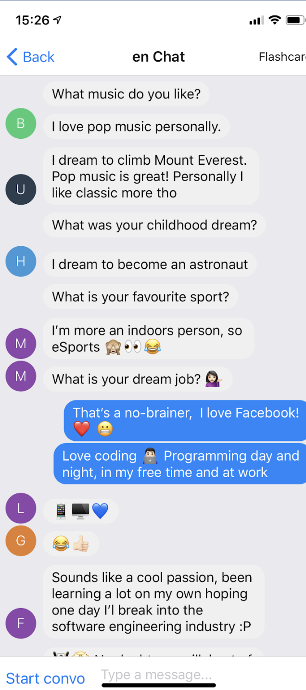

# **PenPal** 🌇 - 2nd Place Winner
### A translation app that connects communities together by making learning new languages meaningful with flashcards and conversation starters, built using `REACT NATIVE`, `NODEJS` & `FIREBASE`
### [LIVE DEMO](https://snack.expo.io/@chrisjim316/penpal) 📱 - [LICENSE](https://github.com/chrisjim316/PenPal/blob/master/LICENSE) 📝

## App demo examples
en_Chat                    |  zh_tw_Chat
:-------------------------:|:-------------------------:
  |  

## Notes
* Works on both android and ios, but for simplicity just run it on ios

## Instructions (8 steps)

1. Install XCode if you haven't already via the [Apple App Store](https://itunes.apple.com/app/xcode/id497799835)

2. Clone the repo and cd into it
```
git clone https://github.com/chrisjim316/PenPal/ && cd PenPal
```

3. Install all libraries and tools required for the project by running this on the command line
```
sudo npm install -g expo-cli && sudo npm install
```

4. To run the iOS application, use the following command:
```
expo start
```

4.1 If the above command fails for you, just go to https://docs.expo.io/versions/latest/introduction/installation.html, find 'Not working?' under 'iOS Simulator' and follow the instructions to **manually install expo** on your iOS simulator. **Then jump to step 7**

5. Click 's' on your keyboard on the command line, click the arrow down key until you are hovering above 'Log in with an existing Expo account' and click enter. Sign in expo using the credentials below
```
Username: chrisjim316
Password: you know it ;)
```

6. Click 'i' on your keyboard on the command line to launch ios simulator

7. Click 'Back to Expo Home'. If not signed in yet, use the credentials above

8. If you see nothing under 'recently in developments' and 'recently opened' open and sign in into https://snack.expo.io/@chrisjim316/penpal on a web browser, click PenPal under 'Snacks'.

9. Check your iOS simulator again, click 'PenPal (@chrisjim316). Should work!

Well done in setting it up! Have fun 🎉
